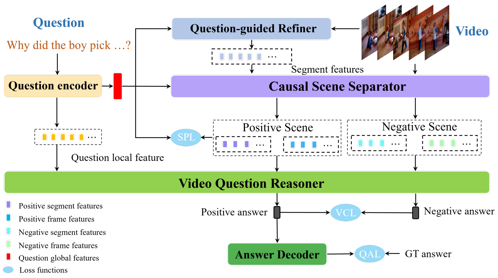

# VCSR
[ACM MM 2023] [Visual Causal Scene Refinement for Video Question Answering](https://arxiv.org/pdf/2305.04224.pdf)

### Abstract
Existing methods for video question answering (VideoQA) often suffer from spurious correlations between different modalities, leading to a failure in identifying the dominant visual evidence and the intended question.
Moreover, these methods function as black boxes, making it difficult to interpret the visual scene during the QA process. In this paper, to discover critical video segments and frames that serve as the visual causal scene for generating reliable answers, we present a causal analysis of VideoQA and propose a framework for cross-modal causal relational reasoning, named Visual Causal Scene Refinement (VCSR). Particularly, a set of causal front-door intervention operations is introduced to explicitly find the visual causal scenes at both segment and frame levels. Our VCSR involves two essential modules: i) the Question-Guided Refiner (QGR)
module, which refines consecutive video frames guided by the question semantics to obtain more representative segment features for causal front-door intervention; ii) the Causal Scene Separator (CSS) module, which discovers a collection of visual causal and non-causal scenes based on the visual-linguistic causal relevance and estimates the causal effect of the scene-separating intervention in a contrastive learning manner. Extensive experiments on the NExT-QA, Causal-VidQA, and MSRVTT-QA datasets demonstrate the superiority of our VCSR in discovering visual causal scene and achieving robust video question answering.


### Model
        
Figure 1: Framework of our proposed VCSR.        

Codes will be available soon!

### Citation
If you use this code for your research, please cite our paper.      
```
@inproceedings{VCSR,
                          title={Visual Causal Scene Refinement for Video Question Answering},
                          author={Wei, Yushen and Liu, Yang and Yan, Hong and Li, Guanbin and Lin, Liang},
                          booktitle={ACM International Conference on Multimedia (ACM MM)},
                          year={2023},
                          organization={ACM}
                        }
``` 
If you have any question about this code, feel free to reach (weiysh8@mail2.sysu.edu.cn;liuy856@mail.sysu.edu.cn).      
